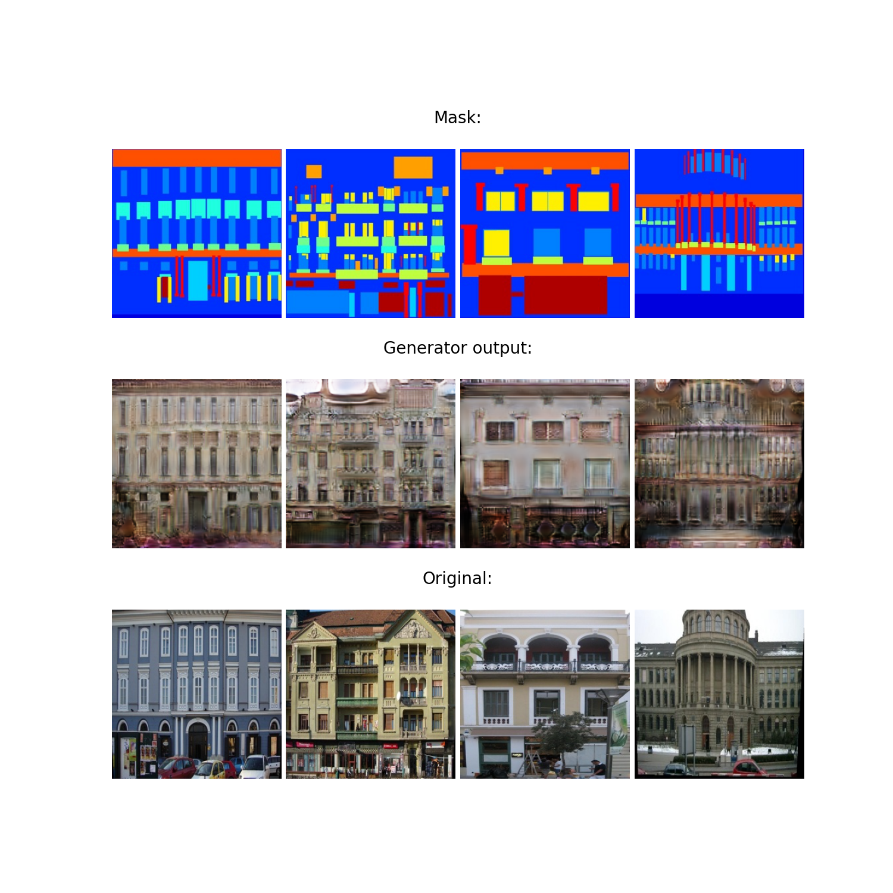
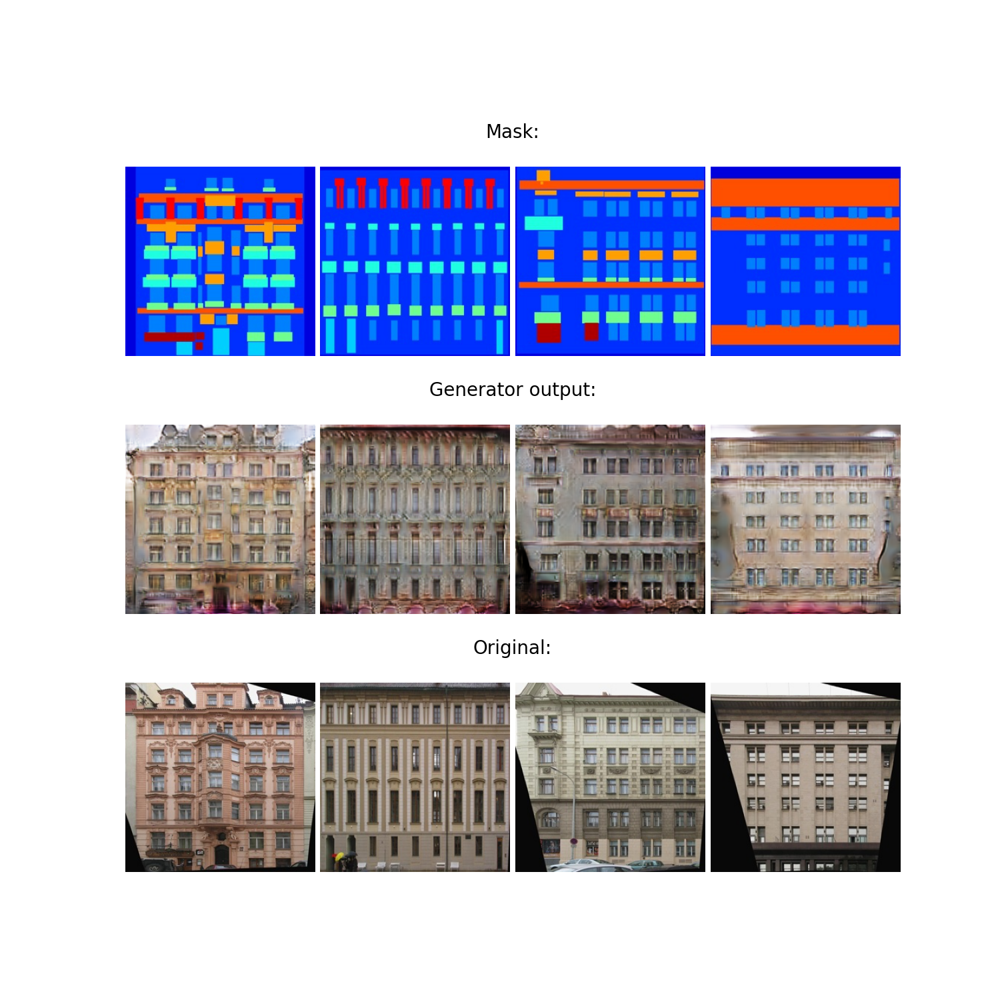
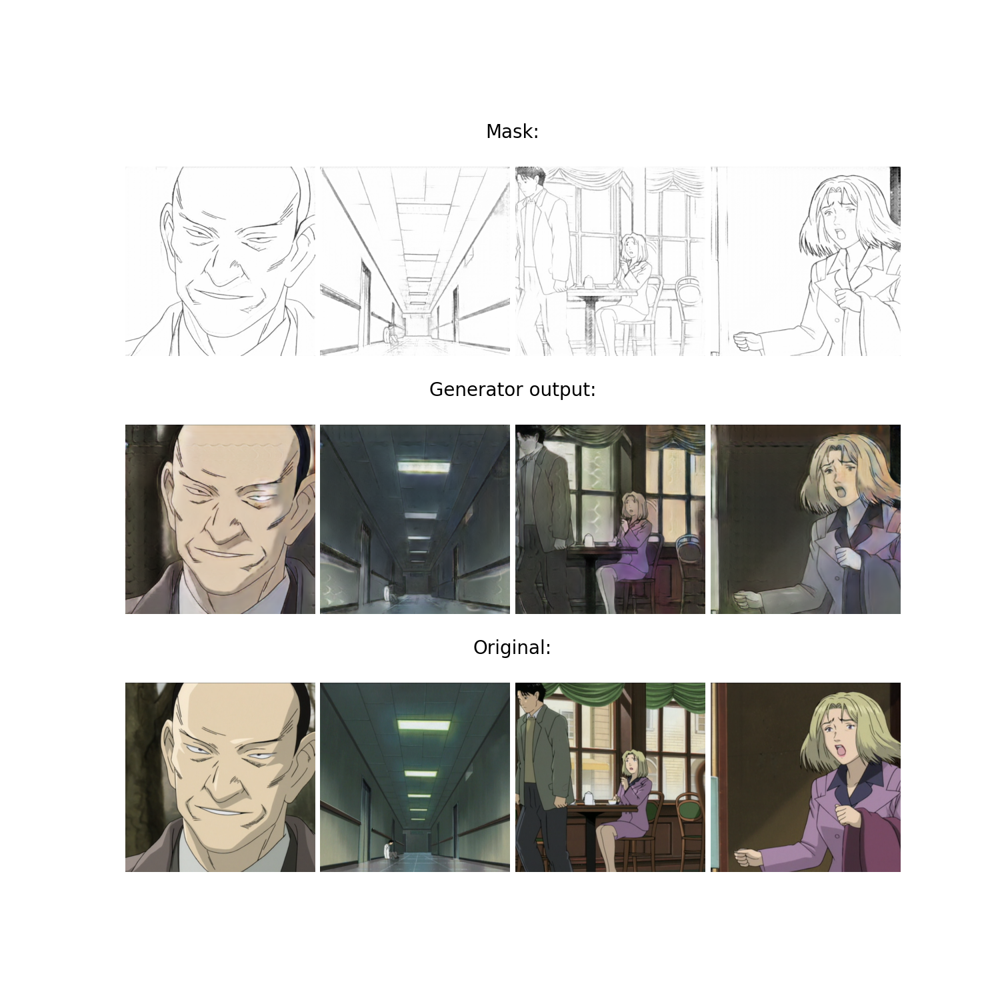
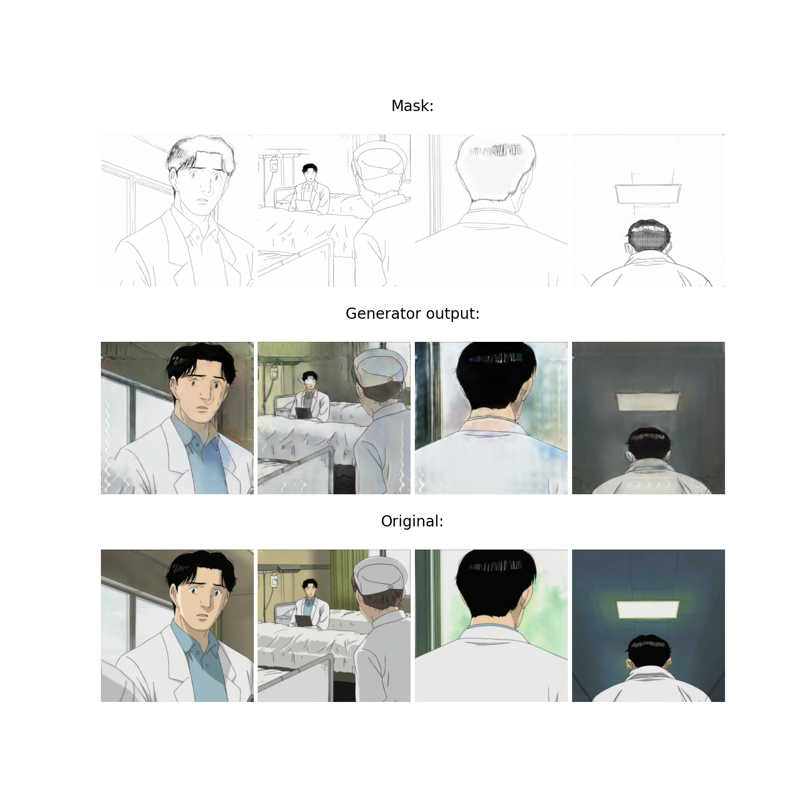
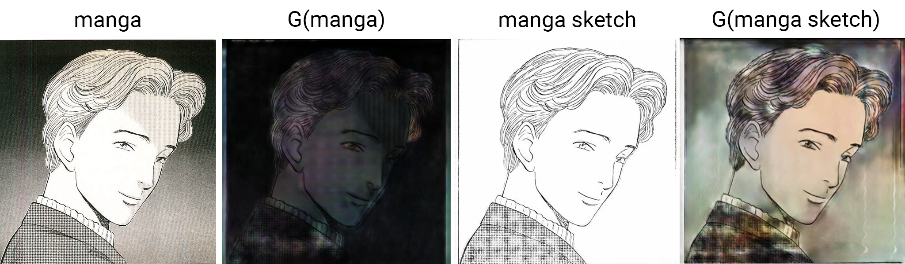
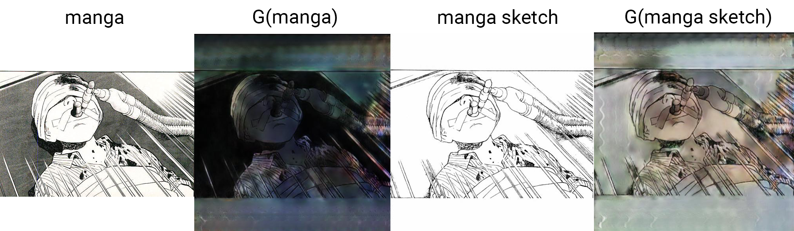

# DLS project (spring 2021) - pix2pix

## Постановка задач

Данный проект ставит целью реализацию [модели pix2pix](https://phillipi.github.io/pix2pix/) <sup>**1**</sup> в контексте следующих проблем:

- Генерация фасадов различных зданий по заданным "маскам". Воспроизведение решения из статьи с [CMP Facade Database](https://cmp.felk.cvut.cz/~tylecr1/facade/).
- Разукрашивание [манги](https://myanimelist.net/manga/1/Monster) с использованием цветовой палитры из соответствующей [аниме-адаптации](https://myanimelist.net/anime/19/Monster). 

Последняя задача довольно полезна, ведь часто бывает так, что экранизацию получает лишь малая часть комикса, а хочется узнать чем все закончится. Цветные изображения, повторяющие стиль аниме, гораздо приятнее обычных черно-белых страниц.

*1. Строго говоря, тут воплощена в жизнь несколько отличная от канона модель. Местами заменены BatchNorm2d и ConvTranspose2d.*

## Обучение и использование модели

Обучить pix2pix можно следующим образом:

```python
# Если не указать файл конфигурации, будет использован configs/default_config.py
# В файле конфигурации хранятся название датасета и параметры обучения
# Под конец веса (и другая полезная информация) сохраняются в папке output
train.py [-c <configuration file path>]
```

Обученная модель (папка output не должна быть пуста) применяется так:

```
generate.py <configuration file path> <images input folder path> <images output folder path>
```

**[Открыть демонстрационный Jupyter Notebook в Google Colab](https://colab.research.google.com/github/jys1670/DataScienceProjects/blob/master/pix2pix/pix2pix_example.ipynb)**

Там же описаны шаги получения аниме датасета с помощью [Anime2Sketch](https://github.com/Mukosame/Anime2Sketch)

## Результаты

Здесь показана лишь малая часть всех полученных изображений. Прочие результаты можно посмотреть скачав [данный файл](https://drive.google.com/uc?id=1-5ZFOdCRgfoZZpmh2Dm73nA0k4eV5MK7).

#### Facades dataset

В целом сгенерированные картинки получились неплохими, похожее качество наблюдалось и в статье.





#### Anime dataset

Из нескольких серий раз в секунду извлекались кадры, которые в дальнейшем были поделены на тестовую и обучающую выборку. Теоретически кадры незначительно отстоящие друг от друга по времени могут быть очень похожими, но все же не должны быть полностью идентичными (ведь интервал 1 секунда). Поэтому формально утечка информации из обучающей выборки в тестовую маловероятна, и текущая задача может быть интерпретирована как разукрашиваение новых промежуточных кадров в анимации.

Результаты по прошествии 50 эпох следующие:





Видно, что сеть хорошо дорисовывает промежуточные кадры.

Теперь попробуем использовать уже обученную модель на манге:





Уже все не столь гладко. При подаче оригинальных черно-белых изображений получаются чрезмерно затемненные картинки. При использовании скетчей ситуация становится лучше, но все же имеются значительные дефекты.

Наиболее вероятной причиной такого поведения является большое количество высокочастотных деталей в манге и соответствующих скетчах. Обучение же проводилось на гораздо менее детализированных масках. 

В перспективе следует рассмотреть аналоги Anime2Sketch, выдающие более шумные наброски, и переобучить модель с их использованием. Хороший кандидат – lnet (PaintsChainer).